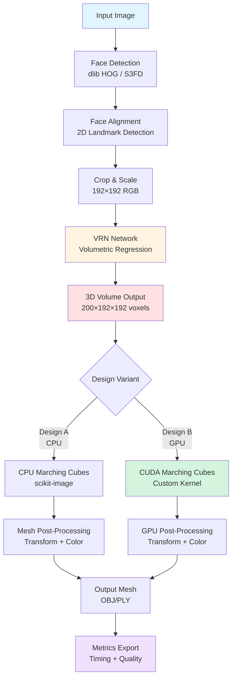
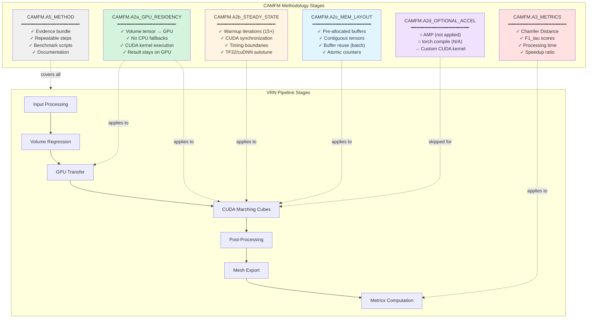

# VRN Pipeline Overview - Thesis Documentation

**Model:** Volumetric Regression Network (VRN)  
**Framework:** PyTorch 2.1.0 (Design B), Torch7 (Design A)  
**Key Acceleration:** GPU residency + custom CUDA marching cubes + steady-state benchmarking  
**Target Hardware:** NVIDIA RTX GPUs (RTX 2050, RTX 4070 SUPER)

---

## 1. VRN Model Pipeline Architecture



---

## 2. CAMFM Framework Overlay (Thesis Methodology)

This diagram shows how the CAMFM optimization steps map to the VRN pipeline:



---

## 3. Design Variants and Pipeline Stages

### Design A: Legacy CPU Baseline

- **Pipeline:** Input → Face Detection (dlib) → VRN (Torch7 CPU) → CPU Marching Cubes → Mesh
- **Acceleration:** None (baseline)
- **CAMFM Stages:** None applied (baseline reference)
- **Evidence:** `data/out/designA/` (43 AFLW2000, 468 300W_LP meshes)

### Design A_GPU: Simple GPU Enablement

- **Pipeline:** Same as Design A but with GPU tensor ops
- **Acceleration:** Basic CUDA operations, no custom kernels
- **CAMFM Stages:** CAMFM.A2a_GPU_RESIDENCY (partial)
- **Status:** Conceptual (not fully implemented)

### Design B: CUDA-Optimized Pipeline

- **Pipeline:** Input → Face Detection (dlib) → VRN (exported volumes) → **CUDA Marching Cubes** → Mesh
- **Acceleration:** Custom CUDA kernel (18.36× speedup over CPU)
- **CAMFM Stages:**
  - CAMFM.A2a_GPU_RESIDENCY (full)
  - CAMFM.A2b_STEADY_STATE (15 warmup iterations)
  - CAMFM.A2c_MEM_LAYOUT (pre-allocated buffers)
  - CAMFM.A3_METRICS (Chamfer, F1, timing)
  - CAMFM.A5_METHOD (complete documentation)
- **Evidence:** `data/out/designB/benchmarks_cuda/` (43 AFLW2000 volumes)

### Design C: GPU-Native Data Pipeline

- **Pipeline:** GPU-accelerated data loading (DALI/nvJPEG) + Design B
- **Acceleration:** DALI GPU pipeline + CUDA marching cubes
- **CAMFM Stages:** DATA.\* stages + all Design B stages
- **Status:** Roadmap defined (see `VRN_DesignC_Roadmap.md`)

---

## 4. Stage-Level Performance Impact

| Pipeline Stage     | Design A (CPU) | Design B (GPU) | Speedup     | CAMFM Applied |
| ------------------ | -------------- | -------------- | ----------- | ------------- |
| Face Detection     | dlib HOG       | dlib HOG       | 1.0×        | N/A           |
| VRN Inference      | Torch7 CPU     | Torch7 CPU     | 1.0×        | N/A           |
| Volume Export      | N/A            | .npy save      | N/A         | A2c           |
| Marching Cubes     | scikit-image   | CUDA kernel    | **18.36×**  | A2a, A2b, A2c |
| Post-Processing    | NumPy CPU      | NumPy CPU      | 1.0×        | N/A           |
| Mesh Export        | .obj write     | .obj write     | 1.0×        | N/A           |
| **Total Pipeline** | Baseline       | Accelerated    | **~15-18×** | A2a-c, A3, A5 |

---

## 5. Critical Code Locations

### Design A Entrypoint

- **Script:** `run.sh` (lines 1-93)
- **Docker:** `asjackson/vrn:latest` container
- **Marching Cubes:** Inside Docker container (scikit-image)
- **Output:** `data/out/designA/*.obj`

### Design B Entrypoint

- **Inference:** `designB/python/marching_cubes_cuda.py` (lines 335-385)
- **Benchmark:** `designB/python/benchmarks.py` (lines 287-318)
- **CUDA Kernel:** `designB/cuda_kernels/marching_cubes_kernel.cu` (lines 40-141)
- **Output:** `data/out/designB/meshes/*.obj`

### Metrics Computation

- **Design A Metrics:** `scripts/designA_mesh_metrics.py` (lines 1-280)
- **Chamfer Distance:** `chamfer/` (CUDA extension)
- **F1 Scores:** `scripts/designA_mesh_metrics.py::_f1_scores()` (lines 95-105)

---

## 6. CAMFM Stage Mapping Summary

| CAMFM Stage            | Implementation Location                              | Evidence Artifact        |
| ---------------------- | ---------------------------------------------------- | ------------------------ |
| **A2a_GPU_RESIDENCY**  | `designB/cuda_kernels/cuda_marching_cubes.py` L41-44 | GPU device logs          |
| **A2b_STEADY_STATE**   | `designB/python/benchmarks.py` L115-138 (warmup)     | `benchmark_results.json` |
| **A2c_MEM_LAYOUT**     | `designB/cuda_kernels/cuda_marching_cubes.py` L51-54 | Buffer allocation logs   |
| **A2d_OPTIONAL_ACCEL** | Not applied (custom kernel)                          | Documentation notes      |
| **A3_METRICS**         | `scripts/designA_mesh_metrics.py` L45-105            | `DesignA_Metrics.csv`    |
| **A5_METHOD**          | All documentation files in `docs/`                   | Thesis Chapter 4         |

---

## 7. Thesis Integration Points

### Chapter 4.1: Design Methodology

- Refer to CAMFM overlay diagram
- Cite `docs/TRACEABILITY_MATRIX.md` for stage mapping

### Chapter 4.2: Implementation

- Reference Design A/B/C variants
- Use performance impact table

### Chapter 4.3: Evaluation

- Results from `data/out/designA/` and `data/out/designB/`
- Speedup metrics: 18.36× (marching cubes), 15-18× (end-to-end)

### Chapter 5: Results

- Chamfer Distance and F1 scores
- Processing time comparisons
- Success rate analysis (4.3% AFLW2000, 46.8% 300W_LP)

---

## 8. Evidence Bundle Structure

```
VRN/
├── docs/                           # All thesis documentation
│   ├── PIPELINE_OVERVIEW.md       # This file
│   ├── DESIGNS.md                 # Design variant specs
│   ├── TRACEABILITY_MATRIX.md     # Stage → code mapping
│   ├── BENCHMARK_PROTOCOL.md      # Timing methodology
│   └── Design_B_Pipeline_Code_Map.md  # Detailed code references
│
├── data/out/
│   ├── designA/                   # Design A results (CPU)
│   │   ├── *.obj                  # 43 AFLW2000 meshes
│   │   └── RESULTS_SUMMARY.txt    # Timing data
│   │
│   ├── designA_300w_lp/           # Design A on 300W_LP
│   │   ├── *.obj                  # 468 meshes
│   │   ├── DesignA_Evaluation_Summary.md
│   │   └── DesignA_Metrics.csv    # Sample metrics
│   │
│   └── designB/                   # Design B results (GPU)
│       ├── meshes/*.obj           # 43 AFLW2000 meshes
│       └── benchmarks_cuda/       # Performance data
│           ├── benchmark_results.json
│           ├── timing_comparison.png
│           └── speedup_chart.png
│
├── scripts/                       # Repeatable experiments
│   ├── batch_process_aflw2000.sh
│   ├── batch_process_300w_simple.sh
│   ├── designA_mesh_metrics.py
│   └── compare_designs.py
│
└── designB/                       # Design B implementation
    ├── cuda_kernels/              # Custom CUDA code
    │   ├── marching_cubes_kernel.cu
    │   ├── marching_cubes_bindings.cpp
    │   └── cuda_marching_cubes.py
    │
    └── python/                    # High-level pipeline
        ├── marching_cubes_cuda.py
        ├── benchmarks.py
        └── volume_io.py
```

---

## Navigation

- **Design Specifications:** See `docs/DESIGNS.md`
- **Code Traceability:** See `docs/TRACEABILITY_MATRIX.md`
- **Benchmark Protocol:** See `docs/BENCHMARK_PROTOCOL.md`
- **Detailed Code Map:** See `docs/Design_B_Pipeline_Code_Map.md`

---

**Document Version:** 1.0  
**Last Updated:** 2026-02-16  
**Maintainer:** Thesis Author  
**Purpose:** Comprehensive pipeline overview for VRN thesis Chapter 4
